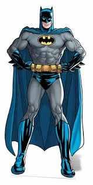

<a id="readme-top"></a>

# Ich bin ein ReadMe

Ich kann den Text **bold** machen oder _kursiv_.

Es gibt Listen, wie ul oder ol.

1. Erstens
2. Zweitens
3. Drittens

- so
- so
- und so

> Zitate kann man auch eingeben

Code kann man auch mit Backticks einfügen: `<h1>Hello World</h1>`

<!-- Hier kommen erstmal 3 Backticks und dann ein Keyword, wie z.B. CSS oder html -->

```html
<section>
  <div class="box1">1</div>
  <div class="box2">2</div>
</section>
```

```css
.box1 {
  background-color: red;
}
```

Hier habt ihr einen Link: [README TEMPLATE](https://github.com/othneildrew/Best-README-Template/blob/master/README.md)

<br/>

[Markdown Cheat Sheet](https://www.markdownguide.org/cheat-sheet/)

<!-- Für das Bild braucht man normalerweise eine URL und Anführungszeichen, aber beim ReadMe kann man direkt den Pfad schreiben -->

Und ein Screenshot oder ein Bild 

<a href="#readme-top">Back to Top</a>
